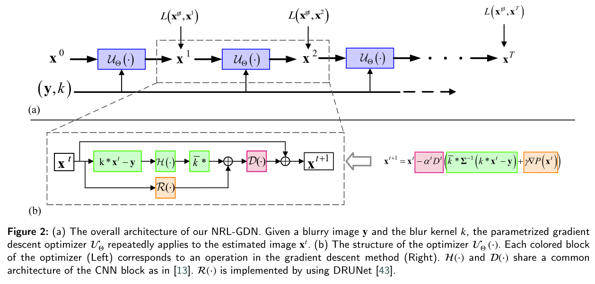
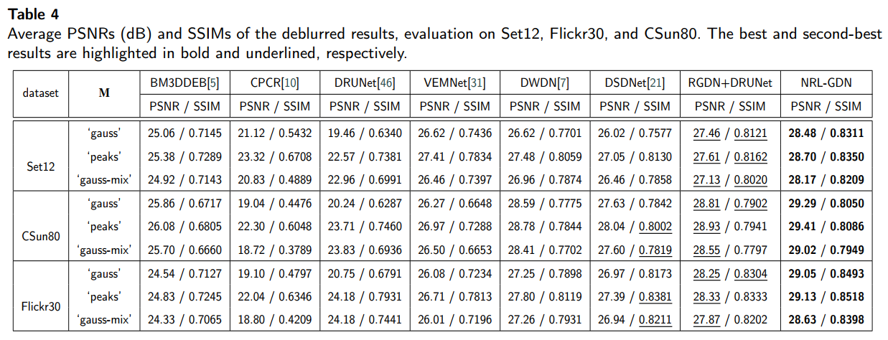

# Noise Variances and Regularization Learning Gradient Descent Network for Image Deconvolution

This repository is the PyTorch implementation of the work:

**Noise Variances and Regularization Learning Gradient Descent Network for Image Deconvolution**

Shengjiang Kong, Weiwei Wang, Yu Han, Xiangchu Feng

To will appear at **[JVCI](https://www.sciencedirect.com/journal/journal-of-visual-communication-and-image-representation) (Journal of Visual Communication and Image Representation)**

## Introduction

Existing image deblurring approaches usually assume uniform Additive White Gaussian Noise (AWGN). However, the noise in real-world images is generally non-uniform AWGN and exhibits variations across different images. This work presents a deep learning framework for image deblurring that addresses non-uniform AWGN. We introduce a novel data fitting term within a regularization framework to better handle noise variations. Using gradient descent algorithm, we learn the inverse covariance of the non-uniform AWGN, the gradient of the regularization term, and the gradient adjusting factor from data. To achieve this, we unroll the gradient descent iteration into an end-to-end trainable network, where, these components are parameterized by convolutional neural networks. The proposed model is called the noise variances and regularization learning gradient descent network (NRL-GDN). Its major advantage is that it can automatically deal with both uniform and non-uniform AWGN. Experimental results on synthetic and real-world images demonstrate its superiority over existing baselines.



## Requirements

Compatible with Python 3

Main requirements: PyTorch 1.7.1 or 1.7.0 are tested

To install requirements:

```shell
pip install torch==1.7.1 torchvision==0.8.2
pip install -r requirements.txt
```

## Evaluation

To evaluate/train the noise variances and regularization learning gradient descent network, run:

```
git clone https://github.com/kongsjsj/NRL-GDN.git
```

- Training with `DataParallel` - PSNR

  You should modify the parameter `is_train=true`from `traincolor.json`

```shell
python deblurring.py
```

- Testing NRL-GDN

  You should modify the parameter `is_train=false`from `configs/traincolor.json` and `is_test_nonuniform=true | sigma_map_type='gauss'or'peaks'or'gauss-mix' `from`configs/test_simulated.json` to produce the results in Table3.

```shell
python deblurring.py
```



## Pre-trained Model

Please download the model from https://drive.google.com/file/d/1BhvaPJaktn-oqboiNgkM8lu4SHBOqvIV/view?usp=drive_link and put it in the folder "./pretrainedmodels/".

| Model                                                        | # params | Remark                        |
| ------------------------------------------------------------ | -------- | ----------------------------- |
| [NRL-GDN](https://drive.google.com/file/d/1BhvaPJaktn-oqboiNgkM8lu4SHBOqvIV/view?usp=drive_link) | 128.51M  | Initialize $x^0$ with Eq.(22) |
| [NRL-GDN-Y0](https://drive.google.com/file/d/1rSOOt1rjXlB9JyKneewpiHI5lUwtmn4s/view?usp=drive_link) | 128.51M  | Initialize $x^0$ with y       |
| [RGDN-Uniform](https://drive.google.com/file/d/1FWAP2XaEJOAUVcT-z6iO2Rb8QDX3R34e/view?usp=drive_link) | 128.51M  | RGDN+DRUNet                   |

## Test Dataset

Please download the test dataset from https://drive.google.com/file/d/1JzctcTB5Nec0laSQwfwbgihPeABG90ke/view?usp=drive_link and put it in the folder "./test_dataset/".